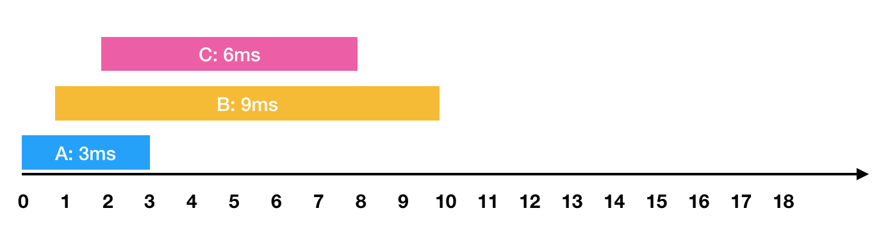

#  [『문제코드』](https://www.acmicpc.net/problem/『문제코드』)：『문제제목』

- | 시간 제한 | 메모리 제한 |
  | :-------: | :---------: |
  |   - 초    |    - MB     |

## 문제

&nbsp; 문제의 그림예시 `<그림 1>`

<p align=center>

</p>

<p align=center>

</p>

&nbsp; 문제의 입력 예시 `<입력 1>`

<div align=center>

```text
0 2 0 1 0
1 0 1 0 0
0 0 0 0 0
0 0 0 1 1
0 0 0 1 2
```

0은 빈 칸, 1은 집, 2는 치킨집이다.

</div>

&nbsp; 답을 구하라.

## 입력

&nbsp; 입력 예시

## 출력

&nbsp; 출력 예시

## 예제

- <table>
    <tr>
    <th>예제 입력 3</th>
    <th>예제 출력 3</th>
    </tr>
    <tr>
    <td valign="top">

  ```txt
  10
  5
  1 1
  1 2
  1 3
  1 4
  7 8
  ```

    </td>
    <td valign="top">

  ```txt
  4
  5
  ```

    </td>
    </tr>
    </table>

- <table>
    <tr>
    <th>예제 입력 3</th>
    <th>예제 출력 3</th>
    </tr>
    <tr>
    <td valign="top">

  ```txt
  10
  5
  1 1
  1 2
  1 3
  1 4
  7 8
  ```

    </td>
    <td valign="top">

  ```txt
  4
  5
  ```

    </td>
    </tr>
    </table>

## 힌트

&nbsp; 힌트 예시

## 출처

- 출처 예시

## 알고리즘 분류

- 구현
- 시뮬레이션
