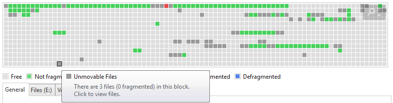

# 듀얼부팅：MultiBoot

[참고 링크](https://snowdeer.github.io/mac-os/2020/10/27/how-to-install-ubuntu-20p04-on-surface-pro-7/)

[참고 동영상](https://www.youtube.com/watch?v=mXyN1aJYefc)

<!-- [테스트](Doc\OS\Linux\듀얼부팅：MultiBoot.md#정리필요) -->

## 목차

- [사전 준비](./듀얼부팅：MultiBoot.md#사전-준비)
  - [기본 디바이스 세팅](./듀얼부팅：MultiBoot.md#기본-디바이스-세팅)
- [우분투 OS 설치 및 환경설정](./듀얼부팅：MultiBoot.md#우분투-os-설치-및-환경설정)
  - [리눅스 설치](./듀얼부팅：MultiBoot.md#리눅스-설치)
    - [Snap](./듀얼부팅：MultiBoot.md#snap)
  - [보조 프로그램 설치](./듀얼부팅：MultiBoot.md#보조-프로그램-설치)
  - [키보드 & 언어팩 설정](./듀얼부팅：MultiBoot.md#키보드--언어팩-설정)
    - [폴더명 영어로 변경](./듀얼부팅：MultiBoot.md#폴더명-영어로-변경)
    - [한글 키보드 문제 수정](./듀얼부팅：MultiBoot.md#한글-키보드-문제-수정)
- [OS 관리 및 제거](./듀얼부팅：MultiBoot.md#os-관리-및-제거)

## 사전 준비

### 기본 디바이스 세팅

- SSD의 BitLocker 해제

  - Windows 11 pro의 기능인 비트 로커(Bit Locker) 는 도난이나 해킹으로부터 보호하여 사용자 데이터 복구를 불가능하게 만드는 Windows에서 제공하는 디스크 암호화 기능입니다. OS가 접근해야하는 드라이브가 암호화가 되어있다면 드라이브가 잠겨 부팅이 안될 수 있습니다.
  - 탐색기에서 C 드라이브를 선택한다음 마우스 오른 클릭, ‘BitLocker 관리’를 선택합니다. 그 다음 ‘BitLocker 끄기’를 선택하면 됩니다. ‘BitLocker 켜기’ 가 목록에 뜨는 경우 애초에 BitLock가 걸려있지 않은 상황입니다.
  - 윈도우 11 Home 에선 bitlocker 기능은 지원하지 않으나 옵션 > 개인 정보 및 보안 > 장치 암호화 항목에서 장치 암호화를 해제할 수 있습니다.

- 파티션 분할

  - 별도의 드라이브 없이 한 드라이브에서 리눅스 운영체제를 설치하려고 한다면, 리눅스 OS가 사용할 공간을 분할하여 줍니다.
  - 이 화면에서도 BitLocker가 정상적으로 적용/해제되었는지 여부를 확인할 수도 있습니다.
  - 지금은 파티션 생성 없이 우툰투 설치과정에서 할당해줄 것 입니다.

    <br />

  - 윈도우 홈 화면에서 우클릭 → 디스크 관리 → 축소할 디스크에 우클릭 볼륨 축소
  - 이 과정에 오류가 발생하여 진행이 어렵다면 MiniTool Partition Wizard 같은 파티션 분할 보조 프로그램을 사용합니다.
  - 파티션의 분할은 해당 드라이브의 데이터(파일 및 기타)의 끝 부분보다 적게 할 수 없습니다. 따라서 Auslogics Disk Defrag 등의 디스크 조각 모음 프로그램등을 통하여 이동이 불가한 데이터 \$Mft::\$bitmap 파일이나 최대절전모드 Hibernate 파일, 가상메모리 pagefile.sys 파일들의 위치를 조정해주셔야 합니다.
    <br />
    <center>

    

    </center>
    <br />

- UEFI 해제

  - mbr2gpt 등을 사용하였거나 파티션 테이블이 MBR(Master Boot Record)이 아니라 GPT(GUID Partition Table) 유형일 경우 UEFI 옵션이 켜있을 확률이 높습니다.
  - UEFI (Unified Extensible Firmware Interface) 옵션은 바이오스의 플랫폼에 의존적인 제약 사항을 극복하고 하드웨어를 더 유연하게 지원하는 옵션입니다. 해당 옵션으로 다른 OS가 설치되어도 하드웨어 진단없이 곧바로 C드라이브 Windows로 부팅될 수 있습니다. 우리는 Ubuntu를 사용할 것이기 때문에 UEFI 옵션을 해제시켜 주어야 합니다.
  - UEFI 메뉴 또는 BIOS에서 해제할 수 있는데, 진입 방법은 각 기기 별로 다르기 때문에 찾아보셔야 합니다.
    - 레노버 아이디어 패드의 경우 부팅용 버튼 구멍에 핀을 꽂아 넣으셔야합니다.
    - 서피스의 경우 들어가는 방법은 전원이 꺼진 상태에서 전원 + Volume Up 키를 오래동안 누르고 있으면 됩니다.
    - [참고링크](https://www.linux.org/threads/ubuntu-22-04-on-surface-pro-7.43071/)

- BIOS 세팅
  - UBUNTU F5 ,F6를 통해서 순서를 바꿀 수 있다.

### 부팅 USB 준비

- USB 준비
  - 완전히 포맷되어 OS 부팅용 USB로 바꿀 최소 4GB 이상의 USB를 준비해야합니다.
- 리눅스 ISO 파일 다운로드
  - 부팅 가능한 리눅스 ISO 파일을 우분투 홈페이지에서 다운로드 받습니다.
- Rufus 설치
  - ISO 파일로 부팅 가능한 USB를 만들어주는 오픈소스 프로그램 Rufus를 설치하여야 합니다
  - Rufus를 사용하여 USB를 부팅 USB 로 바꾸어 줍시다.

## 우분투 OS 설치 및 환경설정

### 우분투 설치

- 리눅스답게 설정이 제멋대로인 부분이 있어서 처음부터 한국어로 설치하고 필요한 부분을 영어로 수정하는 편이 편합니다.
- 어디에 설치하냐는 질문에 Manual installation 선택
- swap 파티션 지정 (스왑 파티션은 일반적으로는 램 크기의 1.5 ~ 2배, 대강 10~20GB 정도로 잡는다.)
- Ext4 파티션 지정 (Mount point는 '/' 로 지정합니다.)

<br/>

#### Snap

- snap은 우분투 개발사 캐노니컬이 밀고있는 패키지 의존성 관리 체계입니다. 자유로운 배포환경에서 서로 의존성을 가진 패키지들이 너무 많아지자 얽히고 섞인 모든 프로그램들을 일일히 설치하고 업데이트하는 상황을 근절하기 위해서 설계되었습니다.

##### snap 사용법

- sudo snap refresh "앱이름" # 특정 요소 업데이트
- sudo snap refresh # 전부 업데이트
- sudo snap refresh --list # 설치하지 않고 업데이트 나열

##### snap 제거

- 사실 딱히 제거해야 할 이유는 없습니다. 오히려 놔두는 쪽을 추천합니다.

- snap이 사용하는 사용 공간이나 (sudo fdisk -l 등을 써보면 패키지 의존성 격리를 위한 dev/loop 파티션이 수두룩하게 나옵니다.) , 자유로운 패키지 배포 환경에서 패키지 통합 시스템의 존재 자체가 부정적으로 받아들여지는 부분이 있습니다. (윈도우 내에서 마이크로소프트 스토어 사용을 강제하는 느낌이라고 이해하시면 될 것 같습니다.)

  ```bash
  $ sudo apt-mark hold snap #앞으로 apt에서 snap 자동설치를 막습니다
  $ sudo apt-mark hold snapd #앞으로 apt에서 snapd 자동설치를 막습니다
  $ sudo apt-mark showhold #홀드 목록 확인
  $ sudo apt update
  $ sudo apt upgrade

  # 귀찮다면
  $ sudo apt autoremove --purge snapd # 빠르게 전체삭제 - 문제 생길 수 있음

  # 정석 방법
  $ snap list # snap 이 관리하는 패키지 목록
  $ snap remove --purge "패키지명" # 해당 패키지 snap 에서 완전제거

  # 영향을 덜 받는 순서대로 삭제하는 쪽이 더 안정적입니다.
  # snap-store >> gtk-common-themes >> gnome >> bare >> core22
  # core 삭제는 snapd에서 사용 중이라 실패할 수 있습니다.
  # 우분투 20.04 이전 $ sudo umount /snap/core"넘버"/"사용자 아이디"
  # 우분투 20.10 이상 $ sudo umount /var/snap

  $ sudo snap remove snapd
  $ sudo apt autoremove --purge snapd

  #다음은 패키지 삭제시 삭제 됐을 폴더이나 한번 더 확인

  rm -rf snap
  rm -rf /snap
  rm -rf /var/snap
  rm -rf /var/lib/snapd
  ```

<br/>

#### Grub 설치 및 조정

- GRUB(GRand Unified Bootloader) 는 멀티부트로더 입니다.
- 디폴트 값을 변경하고 싶다면 Ctrl + Alt + T 터미널 열고 vi /etc/default/grub 또는 해당 위치에 직접 가서 텍스트 에디터로 수정
- 화면 크기
  ```bash
  #grub 파일 잘 보면 #로 주석 처리된 해당 항목이 있을 겁니다.
  #입력할 값은 우분투, 윈도우를 고르는 GRUB 부팅 화면에서 c 입력
  #grub-efi 명령창으로 넘어가고 여기서 videoinfo 입력
  #grub이 지원하는 해상도가 뜹니다.
  #텍스트 크기는 고정이므로 해상도 값을 낮출수록 텍스트 크기가 커집니다.
  GRUB_GFXMODE=1280x1024
  ```
- 부팅 선택 메뉴의 대기 시간 조정

  ```bash
  GRUB_TIMEOUT=10
  ```

- 노트북에서 fn키 화면밝기 조절이 안될 때 (인텔 그래픽 설정 먼저 다룰것)

  ```bash
  GRUB_CMDLINE_LINUX_DEFAULT="quiet splash" #BEFORE
  GRUB_CMDLINE_LINUX_DEFAULT="quiet splash acpi_backlight=vendor"
  ```

- 설정이 끝나면 터미널에서 업데이트

  ```bash
  $ sudo update-grub
  $ sudo reboot
  ```

<br/>

### 보조 프로그램 설치

#### 그놈 쉘 확장：Gnome Shell Extensions

- 명령어

  ```bash
  $ sudo apt install gnome-shell-extensions #확장 묶음
  $ sudo apt install gnome-shell-extension-manager #확장 관리자
  $ sudo apt install gnome-tweaks #기능 개선
  ```

- 사용법

  - 앱 서랍에서 확장 관리자 검색 후 실행
    - `확장 관리자 - 확장 검색`에서 확장 검색
    - `확장 관리자 - 설치된 확장`에서 적용 및 설정
  - 앱 서랍에서 기능 개선(또는 gnome-tweak) 에서 테마 세부 조정

- 자주 쓰이는 확장

  - Blur my shell

    - Overview(앱 서랍)과 Panel(상단 바)에 반투명 디자인을 적용
    - Ubuntu 24 이후 dash board(작업 표시줄) 에는 이미 투명 디자인이 적용되었기 때문에 충돌함. `확장 관리자 - 설치된 확장` 에서 톱니바퀴 모양 설정에 들어가 대시보드에 적용은 해제할 것

  - User Themes

    - 각종 유저 테마를 적용합니다.

      ```bash
      #WhiteSur-gtk-theme
      #https://github.com/vinceliuice/WhiteSur-gtk-theme
      $ cd "theme 폴더 위치 경로"
      #./install.sh -h 로 다른 옵션 검색가능
      $ ./install.sh -m -t all -l -N stable --normal --round

      #마우스 테마 변경
      #방법 1 - 세션 위에서만 적용
      # /home/{사용자이름}/.icons 폴더가 없다면 만들어주세요.
      # .icons 폴더 안에 테마폴더를 집어넣으세요.
      # 기능개선(tweaks) 모양새에서 커서를 바꿀 수 있습니다.
      # 커서 크기는 설정-접근성-보기 항목에 커서 크기가 있습니다.

      #방법 2 - 시스템 전체 적용
      # 다운로드 받은 테마폴더를 /usr/share/icons로 옮깁니다.
      sudo mv ./{테마폴더명} /usr/share/icons

      # 테마폴더 index.theme 파일에 "inherits={고유이름}" 을 적습니다.
      # 다음 명령어를 기입합니다.
      # sudo update-alternatives --install <link> <name> <path> <priority>
      sudo update-alternatives --install /usr/share/icons/default/index.theme x-cursor-theme /usr/share/icons/ComixCursors-LH-White-Small/index.theme 91

      # 터미널에서 해당 명령어 입력 후 원하는 마우스 테마 번호 입력 엔터
      $ sudo update-alternatives --config x-cursor-theme
      ```

  - Compiz alike magic lamp effect
    - MacOS 처럼 지니 요술램프 효과를 적용합니다.

<br />

#### Surface Pro 보조 세팅

- 커널 업데이트
  - 서피스는 마이크로소프트의 태블릿이다보니 리눅스-서피스라는 커널로 업데이트해야 보안처리된 하드웨어 컨트롤이 가능합니다.
  - [참고링크](https://snowdeer.github.io/mac-os/2020/10/27/how-to-install-ubuntu-20p04-on-surface-pro-7/)
  - [linux-surface의 깃허브 주소](https://github.com/linux-surface/linux-surface/wiki/Installation-and-Setup)

<br/>

#### GIT 설치

- git 설치

  ```bash
  sudo apt install git #git 설치
  git --version #git 버전 확인

  #깃에 push했을때 올라갈 정보
  git config --global user.name [이름]
  git config --global user.mail [메일 주소]
  ```

- Github Desktop

  - [공식 문서](https://gist.github.com/berkorbay/6feda478a00b0432d13f1fc0a50467f1)
  - 설치 커맨드

    ```bash
    $ sudo wget https://github.com/shiftkey/desktop/releases/download/release-3.3.3-linux1/GitHubDesktop-linux-amd64-3.3.3-linux1.deb

    $ sudo apt install ./GitHubDesktop-linux-amd64-3.3.3-linux1.deb -y
    ```

<br/>

#### Microsoft Edge 설치

- 난 곧 죽어도 엣지를 쓰겠다
- 파이어폭스 삭제

  ```bash
  $ sudo apt purge firefox
  ```

- 엣지 설치

  ```bash
  $ sudo apt update #설치 가능한 패키지 리스트를 최신화

  $ sudo apt install software-properties-common apt-transport-https wget #software-properties-common : add-apt-repository 추가
  #apt-transport-https : https를 통해 데이터 및 패키지에 접근
  #wget : HTTP/FTP 통신 파일 다운로드 소프트웨어

  $ wget -q https://packages.microsoft.com/keys/microsoft.asc -O- | sudo apt-key add - #wget을 이용해서 마이크로소프트의 GPG 키를 다운로드합니다. GPG 키는 비공개키 알고리즘의 형태이며 설치 프로그램의 무결성을 판단하기 위해서 필요합니다.

  $ sudo add-apt-repository "deb [arch=amd64] https://packages.microsoft.com/repos/edge stable main" #엣지 브라우저 레포지토리 활성화

  $ sudo apt install microsoft-edge-dev #엣지 패키지 다운로드

  $ microsoft-edge #엣지 실행 명령어

  #새 버전이 릴리즈 됬을 경우

  $ sudo apt update #업데이트 리스트 최신화

  $ sudo apt upgrade #Edge 패키지를 업데이트
  ```

#### Visual Studio Code 설치

- VS code 설치

  - 엣지 설치와 크게 다르지 않습니다.

    ```bash
    $ sudo apt update #설치 가능한 패키지 리스트를 최신화

    $ sudo apt install software-properties-common apt-transport-https wget #HTTP/FTP 통신 파일 다운로드 소프트웨어 wget 설치

    $ wget -q https://packages.microsoft.com/keys/microsoft.asc -O- | sudo apt-key add - #wget을 이용해서 마이크로소프트의 GPG 키를 다운로드합니다. GPG 키는 비공개키 알고리즘의 형태이며 설치 프로그램의 무결성을 판단하기 위해서 필요합니다.

    $ sudo add-apt-repository "deb [arch=amd64] https://packages.microsoft.com/repos/vscode stable main" #vscode 레포지토리 활성화

    $ sudo apt install code #vscode 패키지 다운로드

    $ code #vscode 실행 명령어

    $ sudo code --user-data-dir="열 폴더 따옴표 포함" #관리자 권한으로 실행

    #새 버전이 릴리즈 됬을 경우

    $ sudo apt update #업데이트 리스트 최신화

    $ sudo apt upgrade #Edge 패키지를 업데이트
    ```

<br/>

#### Waydroid 안드로이드 OS 에뮬레이터

- [동영상](https://www.youtube.com/watch?v=tJ-Mna_zi0o)
- [공식 문서](https://docs.waydro.id/usage/install-on-desktops)
- 디스플레이 서버를 X11에서 Wayland 로 변경하기

  - Waydroid는 Wayland를 기반으로 돌아갑니다.
  - 터미널에 echo $XDG_SESSION_TYPE 를 입력하면 확인이 가능합니다.
  - 로그오프하여 로그인 화면으로 돌아가면 우측하단에 톱니바퀴가 있습니다. 클릭하면 바꿀 수 있습니다.
  - 오류 해결 1. 설정에서 Wayland가 막혀있는 지 확인

    ```bash
    $ sudo vi /etc/gdm3/custom.conf
    #해당 파일에서 WaylandEnable=true 주석 해제 및 true 설정

    $ sudo systemctl restart gdm3 #적용된 gdm3
    ```

  - update-alternatives --config x-session-manager
  - 바꾸고 나서 오류가 나거나 아예 켜지지 않고 로그인 화면으로 돌아가는 경우도 있습니다.<br/>
    wayland 는 최신 nvidia 드라이버와 충돌하는 이슈가 있기 때문입니다.<br/>
    세 가지 방법 중 하나로 해결해야 합니다.
    1. nouveau 오픈소스 그래픽 드라이버로 바꾼다.
    2. nvidia 드라이버의 버전을 470 이하로 낮춘다.
    3. nvidia 드라이버의 Wayland 호환 라이브러리를 설치한다.
       ```bash
       $ sudo apt install libnvidia-egl-wayland1
       $ sudo nano /etc/gdm3/custom.conf #파일에서 WaylandEnable=true 설정
       $ sudo systemctl restart gdm3 #리스타트
       ```

<br/>

- 폴더 정리
  - ㄴㅇㄴㅇ

<br/>

- Waydroid 설치

  ```bash
  #방법 1. Curl 로 받아오기
  #Curl 설치
  $ sudo apt install curl ca-certificates -y
  $ curl https://repo.waydro.id | sudo bash

  #방법 2. wget 으로 받아오기
  # -q 로깅을 하지 않는다
  # -O 다운로드 출력을 stdout으로 리다이렉팅 한다
  $ wget -q -O- https://repo.waydro.id | sudo bash

  #Waydroid 설치
  $ sudo apt install waydroid -y

  #Waydroid-container service 서비스 제어 명령으로 시스템에 등록
  sudo systemctl enable --now waydroid-container

  #앱을 처음 키면 initializer VANILLA GAPPS 중 하나 선택
  #VANILLA = 안드로이드 에뮬레이터만 설치
  #GAPPS = 구글 생태계 앱 설치
  ```

- Google Play Certification

  - [링크](https://docs.waydro.id/faq/google-play-certification)

- [문제해결 공식문서](https://docs.waydro.id/usage/install-on-desktops)

<br/>

### 키보드 & 언어팩 설정

#### 시스템 한국어 미적용 문제

- 우분투 상단바 우측을 클릭하면 톱니바퀴 모양의 설정 버튼이 있습니다.
- 설정 <br/>`-⇀` 시스템 <br/>`-⇀` 지역 및 언어(Region & Language) <br/>`-⇀` 설치된 언어 관리(Manage Installed languages)
- \[ Install / Remove Language... \] 클릭하여 한국어를 선택하고 apply를 눌러주세요.
- 드래그하여 한국어를 영어보다 최상단으로 올려주세요.
- \[ Apply System-Wide \] 를 클릭하여 전역적으로 설정을 맞춰주세요.
- 해당 창의 Regional Formats 탭으로 넘어가서 시간표기 포맷도 한국어로 바꿔줄 수 있습니다.
- 변경된 언어 설정은 Restart 다시시작 후에 적용됩니다.
- 다시시작하면 폴더명을 한글 이름에 맞춰 바꿀 것인지 물어보는데 영어로 유지하는 편이 좋습니다. 한글명 폴더에서는 문제가 생기는 경우가 있어요.

#### 폴더명 영어로 변경

- 바탕화면, 문서등 시스템 폴더 명은 항상 영어로 유지하는 편이 좋습니다.
- 한글 폴더명은 console 등에서 입력하기 불편해서 다음과 같은 방법으로 영어 이름으로 변경해서 사용합니다.
- `Ctrl + h` 를 누르면 GUI 탐색기에서 숨김폴더 .config 를 볼 수 있습니다.
- .config/user-dirs.dirs 파일 안의 내용을 다음과 같이 수정해줍시다. 해당 파일이 없을 경우 직접 만들어주세요

  ```bash
  # 수정전
  XDG_DESKTOP_DIR=”$HOME/바탕화면”
  XDG_DOWNLOAD_DIR=”$HOME/다운로드”
  XDG_TEMPLATES_DIR=”$HOME/서식”
  XDG_TEMPLATES_DIR=”$HOME/공개”
  XDG_TEMPLATES_DIR=”$HOME/문서”
  XDG_TEMPLATES_DIR=”$HOME/음악”
  XDG_TEMPLATES_DIR=”$HOME/사진”
  XDG_TEMPLATES_DIR=”$HOME/비디오”

  # 수정후
  XDG_DESKTOP_DIR=”$HOME/Desktop”
  XDG_DOWNLOAD_DIR=”$HOME/Downloads”
  XDG_TEMPLATES_DIR=”$HOME/Templates”
  XDG_DESKTOP_DIR=”$HOME/Public”
  XDG_DOWNLOAD_DIR=”$HOME/Documents”
  XDG_TEMPLATES_DIR=”$HOME/Music”
  XDG_DOWNLOAD_DIR=”$HOME/Pictures”
  XDG_TEMPLATES_DIR=”$HOME/Videos”
  ```

- 위와 같이 실제 한글명 폴더들도 모두 영어로 수정해주세요. 아예 삭제하시고 새로 영어명 폴더를 만들어주셔도 괜찮습니다.
- 로그오프 후 다시 로그인하면 수정이 끝납니다.

#### 한영키 작동안함

- 설정 `-⇀` 키보드 항목에서 \[입력 소스 추가\] 버튼을 클릭해주세요.
- 한국어 `-⇀` 한국어(Hangul) 을 추가해준 다음 다른 키보드를 전부 삭제해주세요.
- 한국어(Hangul) 키보드 칸 우측의 ⁝ 버튼을 클릭하시면 기본 설정 창을 킬 수 있습니다.
- 한영전환키 항목에 추가를 누르시고 현 키보드의 한영키를 눌러주세요. 보통은 Alt_R(오른쪽 알트키) 입니다. 추가하고 싶은 한영키 동작 버튼이 있으시면 추가하셔도 됩니다.

#### 한글 자모음 분리

- 우분투는 기본적으로 ibus 를 입력기로 사용합니다. ibus는 다국어 입력을 지원은 하지만 영어 외의 언어에서 문제가 발생하기도 합니다.
- 첫번째 방법은 다른 입력기를 사용하는 것입니다.
- 두번째 방법은 ibus 한글 지원버전인 ibus-hangul이 제대로 적용되고 있는지 확인하는 것 입니다.

1. ibus 해결안

   ```bash
   #우분투 최신버전에서는 이미 ibus-hangul을 지원합니다.
   $ apt list --installed ibus* #ibus-hangul 있는지 확인

   #없다면 패키지 리스트 직접 추가 후 설치
   $ sudo add-apt-repository ppa:createsc/3beol
   $ sudo apt-get update
   $ sudo apt-get install ibus ibus-hangul

   #있다면 최신화
   $ sudo apt-get install --only-upgrade ibus-hangul

   ibus-setup #Ibus 기본 설정창
   #입력기에서 한국어 추가하기
   ```

- ibus 한글 패치 설치를 위해 PPA(Personal Package Archive) 를 추가해주어야합니다. 리눅스의 업데이트는 각 프로그램이 직접하지 않고 패키지 저장소를 통해서 진행됩니다. 공식적인 패키지 저장소에서는 대중적인 프로그램들만 주로 담겨있습니다. PPA는 Third Party Software에 대한 패키지를 위해서 런치패드에서 제공하는 개인용 소프트웨어 패키지 저장소입니다.
- $ sudo add-apt-repository ppa:createsc/3beol

1. nimf 한글입력기 https://blog.naver.com/tinz6461/221870269557
2. uim 한글입력기 https://blog.naver.com/tinz6461/221870269557
3. fcitx 한글입력기 https://wscode.tistory.com/121

#### 화면 키보드 문제

- [Improved OSK GNOME extension](https://www.omglinux.com/improved-gnome-on-screen-keyboard/)
- [수정 중](https://github.com/inte99ral/IMPROVED_OSK_KR)

##### On-Screen Keyboard Layout

- 우분투 상단바 우측을 클릭하면 톱니바퀴 모양의 설정 버튼이 있습니다.

## 에러 대응책 및 조언

### APT 패키지 설치 문제

#### 소프트웨어 및 업데이트 설정

- 소프트웨어 및 업데이트 앱 클릭
- 인터넷에서 다운로드 가능한 소프트웨어 항목 체크 상태 확인

#### 미러링 주소로 변경

기본적으로 패키지 목록은 https://archive.ubuntu.com/ubuntu 주소에서 받아옵니다.

```bash
# 현재 패키지 목록을 받아오는 주소 확인
apt-add-repository -L

#source.list 파일 수정
sudo vi /etc/apt/sources.list

#파일 내에는 주소가 한 줄마다 다음의 법칙을 따라 작성되어 있습니다.
# <package version> <mirror site url> <release code> <repository component1, component2, ...>

#<Repository Component> 는 다음과 같습니다.
# Main : Ubuntu 무료 및 오픈소스 소프트웨어
# Universe : Linux 커뮤니티의 무료 및 오픈소스 소프트웨어
# Restricted : Vender 장치 드라이버 및 소프트웨어
# Multiverse : 법적 제한(저작권 등)이 있는 소프트웨어
#(예시) deb http://archive.ubuntu.com/ubuntu jammy-backports main restricted


```

#### E: Package {패키지명} has no installation candidate

- E: Package {패키지명} has no installation candidate
  Ubuntu 가 설치되면 기본적으로 아래와 같이 /etc/apt/sources.list 파일로 Repository 가 관리됩니다.

### 우클릭을 해도 새 파일을 만들 수가 없습니다.

- 터미널에서 `vi {파일명}` 이나 `gedit {파일명}` 명령어로 생성하실 수 있습니다.
- /home/{사용자이름}/Templates 폴더 안에 예시용 빈 파일을 넣으시면 우클릭으로 생성하는 서식으로 취급됩니다.

### 시스템 폴더나 숨긴 파일들이 안보입니다

- 탐색기에서 `Ctrl + H` 단축키를 입력하시면 숨긴 파일들이 보입니다.
- Linux 체계에선 .으로 시작하는 폴더나 파일은 숨긴 파일로 취급합니다.

### apt 패키지 주소 중복

- 여러 패키지를 받는 과정에서 같은 패키지를 중복으로 요청할 경우에 발생합니다.
- 중복되는 패키지 주소 중 하나만 남기고 rm 명령어로 삭제해주시면 됩니다.

### kr.archive.ubuntu.com'의 주소를 알아낼 수 없습니다

1. DNS 주소 변경

   - 새로운 Ubuntu를 설치하거나, 네트워크 설정이 변경되었을때, apt 명령어를 이용하다보면 해당 오류가 발생할 때가 있습니다. 고정 IP를 사용하는 경우에 DNS 설정이 제대로 되어있지 않으면 발생합니다. 특정 DNS 등을 넣어주면 해결됩니다.
   - 보통 나 자신을 의미하는 로컬호스트 NameServer인 127.0.0.53 일 것입니다. 대표적인 DNS NameServer인 8.8.8.8 (Google) 1.1.1.1 (Cloudflare) 로 변경해주면 해결됩니다.
   - /etc/systemd/resolved.conf

     ```bash
     sudo vi /etc/systemd/resolved.conf
     # DNS= 항목 주석 없애고 DNS=8.8.8.8 입력 후 저장

     systemctl restart systemd-resolved.service

     systemd-resolve --status #우분투 22 이전
     resolvectl status #우분투 22 이후
     ```

2. 미러 사이트 변경

   - /etc/apt/sources.list 은 /etc/apt/sources.list.d/ubuntu.sources 로 위치가 바뀌었습니다.
   - [참고링크](https://sh1r0hacker.tistory.com/124)

### Nvidia 그래픽 드라이버 문제

- 주의 사항
- Nouveau 드라이버 비활성화

  ```bash
  $ sudo lsmod | grep nouveau #Nouveau 드라이버 확인

  # 1. 아래 파일을 찾거나 생성
  sudo vi /etc/modprobe.d/blacklist-nouveau.conf

  # 2. 아래 내용 blacklist-nouveau.conf에 추가
  blacklist nouveau
  options nouveau modeset=0

  # 3. 초기 램 파일 시스템 업데이트
  sudo update-initramfs -u

  # 4. 리부트
  sudo reboot
  ```

- Nvidia 드라이버 설치

  ```bash
  #인텔 그래픽은 소프트웨어 업데이터(Software and Updates) 앱이 자동관리합니다.
  #다음 명령으로 엔비디아 gforce가 있는지 확인
  $ sudo lshw -c display #그래픽 전체 사양
  $ sudo lspci | grep VGA #그래픽카드 사양 확인

  #엔비디아 그래픽카드 드라이버 확인
  $ cat /proc/driver/nvidia/version #없으면 No such file or directory

  #선택 1. 드라이버 목록 중에서 "nvidia-driver-<>" 수동설치
  # 주의사항!! : 엔비디아 칩과 호환성 문제로 X11이 기본 디스플레이 서버일 수 있습니다.
  # Wayland 는 엔비디아드라이버 535 이전의 버전과 충돌합니다.
  # Wayland 로 렌더링하는 상황이 필요하다면 535 이상의 드라이버를 받거나 호환성 nouveau 드라이버를 사용해야합니다.
  $ sudo ubuntu-drivers devices #설치가능한 드라이버 목록
  $ sudo apt install nvidia-driver-535

  #선택 2. 권장 드라이버 자동설치
  $ sudo add-apt-repository ppa:graphics-drivers/ppa
  $ sudo ubuntu-drivers autoinstall

  #드라이버는 재부팅 후에 적용됩니다
  $ sudo reboot

  #정상적으로 설치되었나 확인
  $ cat /proc/driver/nvidia/version
  $ sudo nvidia-settings
  $ nvidia-smi
  ```

- Nvidia 드라이버 제거

  - Grub에서 recovery 모드로 진입 - root shell 엔터치고 한 후 커맨드 라인으로 들어간다
  - 명령어 입력

    ```bash
    $ sudo nvidia-uninstall
    $ sudo apt-get purge *nvidia*
    $ sudo apt autoremove
    $ sudo apt autoclean

    #nouveau 블랙리스트 해제 및 복구
    $ sudo rm /etc/modprobe.d/blacklist-nouveau.conf
    $ echo 'nouveau' | sudo tee -a /etc/modules

    $ sudo apt-get install xserver-xorg-video-nouveau
    #잘 안되면 $ sudo apt-get install --reinstall xserver-xorg-core libgl1-mesa-glx

    #xorg.conf 디스플레이 서버 세션 복구를 위한 삭제
    $ sudo rm /etc/X11/xorg.conf

    $ sudo update-initramfs -u
    $ sudo update-initramfs -k all -u #커널 재빌드

    #우분투 데스크탑 세팅 복구
    $ sudo apt-mark showhold
    $ sudo apt-mark hold snap
    $ sudo apt-mark hold snapd # 앞으로 apt에서 snap 자동설치를 막습니다
    $ sudo apt-get install ubuntu-desktop
    $ sudo apt-get install ubuntu-session

    $ sudo apt autoremove
    $ sudo apt autoclean

    lsmod | grep nouveau
    ```

<br/>

## OS 관리 및 제거

### 배드섹터 검사

- [참고 링크](https://sharkmino.tistory.com/1543)
- OS가 설치된 디스크를 검사하려면 USB 부팅을 통해서 접근해야 합니다.
- $ sudo fdisk -l `# 디스크 목록 확인`

### 특정 프로그램 제거

- [참고 링크](https://velog.io/@coral2cola/Ubuntu-%ED%8C%A8%ED%82%A4%EC%A7%80-%EC%82%AD%EC%A0%9C%ED%95%98%EA%B8%B0)
- Ubuntu에서 패키지 설치 및 제거는 dpkg(Debian Package)와 apt(Advanced Package Tool)를 이용한다.
- apt 쪽이 dpkg 의
- $ apt --installed list #또는 dpkg -l #다운로드 된 패키지 전체 검색
- $ apt --installed list `*제거하고자 하는 패키지이름*` #또는 dpgk list --installed | grep
- $ apt purge `*제거하고자 하는 패키지이름*` #remove 명령어는 환경설정 정보를 남긴다
- sudo apt clean
- sudo apt autoremove

### 우분투 제거

- 윈도우 OS 로 컴퓨터 키고 작업표시줄 윈도우 버튼 우클릭 <br/>`-⇀` 디스크 관리 <br/>`-⇀` 우분투가 깔려있는 파티션 포맷
- 쉬프트 + 다시시작 으로 윈도우 OS 안전모드에 진입 [참고링크](https://askubuntu.com/questions/429610/uninstall-grub-and-use-windows-bootloader)
  - GRUB 화면으로 넘어간다면 다음의 해결책이 있습니다.
    1. 윈도우 부팅 USB로 진입하고 `[Shift] + [F10]` 또는 설치화면에서 시스템 복구로 안전모드 진입
    2. BIOS 에 진입해서 부팅 순서를 F5, F6 버튼으로 조정하여 윈도우를 최우선으로 맞춰주고 쉬프트 + 다시시작으로 안전모드 진입
- 파란 안전모드 화면에서 문제해결(Troubleshoot) 클릭 <br/>`-⇀` 고급 옵션(Advanced option) <br/>`-⇀` 명령 프롬프트(Command Prompt) 클릭

  - 방법 ① : 직접 UEFI에서 Ubuntu 부팅 옵션 제거하기

    ```bash
    #파티션 우분투 제거 확인
    diskpart
    list disk
    select disk <NUMBER>
    list partition
    select partition <NUMBER>
    delete partition
    #[ctrl + c] 입력해서 나가기

    #EFI 시스템 파티션을 임의의 S 드라이브에 마운트 합니다. 드라이브 이름으로 사용되지 않은 알파벳이면 아무거나 상관없습니다. 여기선 S를 예시로 사용합니다.
    mountvol S: /S

    # S: 에 할당된 EFI 파티션과 폴더에 접근합니다. cd S:\EFI 와 동일한 동작입니다.
    S:
    cd .\EFI\

    # 부트로더에 우분투 폴더가 있는 지 확인합니다.
    dir

    #둘 중에서 상황에 따라 택 1로 우분투 폴더를 지웁니다
    #1. cmd 기준 명령어
    rmdir /s /q Ubuntu #옵션 s : 안에 전부 삭제, 옵션 q : 묻지마
    #2. 파워쉘 기준 명령어 (.net 기반이라 윈도우 부팅 USB에선 구동 X)
    Remove-Item -Recurse Ubuntu

    # X:\sources> 경로로 복귀
    X:
    ```

  - 방법 ② : Windows 의 부팅옵션 복구 기능으로 Ubuntu 부팅 옵션 제거

    ```bash
    bootrec /fixmbr
    bootrec /fixboot #액세스가 거부되었으면 다음으로 넘어가세요.
    bootrec /scanos #OS 스캔 명령이라 조금 기다리셔야 합니다.
    bootrec /rebuildbcd #부트레코드를 복구하는 명령이기에 복구 정도를 물어봅니다. Add installation to boot list? Yes(Y)/No(N)/All(A) 질문이 뜬다면 A 를 입력해주면 됩니다.

    sfc /scannow #윈도우 System File Checker 무결성 검사
    exit
    ```

- 끝났습니다. 창을 닫고 처음의 파란 안전모드 화면에서 Continue 를 선택하여 윈도우OS 부팅을 확인해줍시다.
- 디스크 MBR or GPT 상태나 디스크 조각 상태, 배드섹터 확인 등 복구 과정에서 윈도우 OS 환경에 혹시라도 문제가 생기지 않았는 지 돌아봐 소중한 윈도우를 챙겨줍시다.

# 정리필요

[멀티제스처](https://steady-hello.tistory.com/122)
