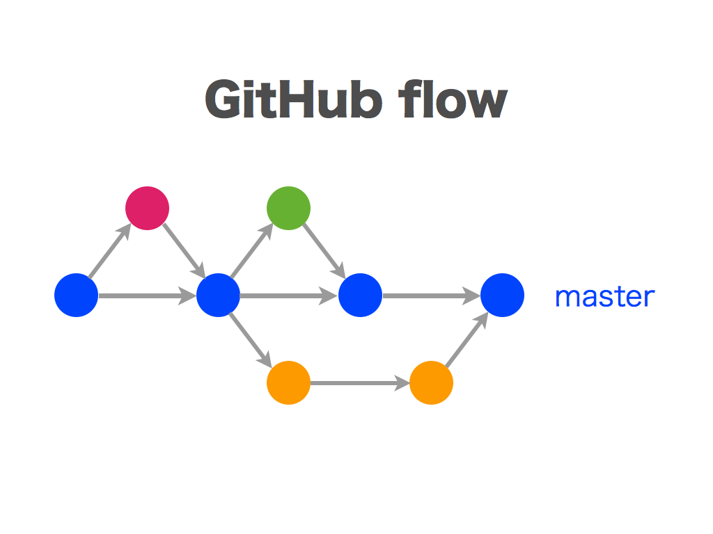
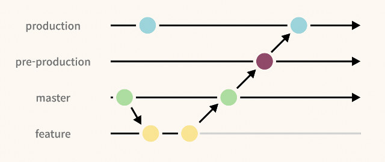

# 깃：Git

## 목차

- [참고 문서](.\Git：깃.md#참고-문서)
- [Git 명령어 목록](.\Git：깃.md#git-명령어-목록)
- [Git 사용 팁](.\Git：깃.md#git-도구)
- [Git 도구](.\Git：깃.md#git-도구)
- [Git 컨벤션](.\Git：깃.md#git-컨벤션)
  - [작명법](.\Git：깃.md#작명법)
    - [브랜치 네임](.\Git：깃.md#브랜치-네임)
    - [커밋 메세지](.\Git：깃.md#커밋-메세지)
    - [Pull Request 메세지](.\Git：깃.md#pull-request-메세지)

## 참고 문서

- [참고 링크：Git 공식 페이지](https://git-scm.com/docs)
- [참고 링크：Git 명령어 모음](https://velog.io/@delilah/GitHub-Git-%EB%AA%85%EB%A0%B9%EC%96%B4-%EB%AA%A8%EC%9D%8C)

<br />

## Git 명령어 목록

<center>
<table class="example">
<tr class="center">
  <th>동작</th>
  <th>명령어</th>
</tr>
<tr>
  <td>GIT 설정</td>
  <td>

```bash
git config --list #전체 설정 확인, :상태에서 q를 누르면 git bash에서 나가진다.
git config user.name #사용자 이름 확인
git config user.email #사용자 이메일 확인

git config --global user.name "사용자 이름" #사용자 이름 설정
git config --global user.email "사용자 이메일" #사용자 이메일 설정
```

</td>
</tr>
<tr>
  <td>저장소<br />신규 생성</td>
  <td>

```bash
git init
```

</td>
</tr>
  <tr>
  <td>저장소<br />복제 &<br />변경사항<br />수용</td>
  <td>

```bash
git clone "https://.. URL" #URL 주소
git clone "/로컬/저장소/경로" #로컬 디렉토리 주소

git pull #저장소의 변경사항을 모두 수용합니다.
git pull origin "대상브랜치" #저장소 해당 브랜치의 변경사항을 모두 수용합니다.

git fetch #변경사항을 가져오되 병합은 하지 않습니다.
git merge "대상 브랜치 이름" # 대상 브랜치의 변경사항을 현재 브랜치에 병합합니다.

git merge --no-ff 『대상 브랜치 이름』 # 병합 시에 반드시 병합 커밋을 형성합니다.병합할 두 브랜치가 Fast-Forward 관계에 있을 때 하나의 브랜치로 보고 병합 커밋을 생성하지 않으며 포인터만 넘기는 것을 허용하지 않습니다. 반드시 병합 커밋을 형성합니다.
```

</td>
</tr>
  </tr>
  <tr>
  <td>변경사항 적용</td>
  <td>

```bash
git status #git이 관리하고있는 파일들의 상태를 보여줍니다.

git add "파일명" #해당 파일의 변경을 스테이지에 올립니다.
git add * #모든 변경을 스테이지에 올립니다.
git add . #.gitignore 제외, 모든 변경을 스테이지에 올립니다.

git commit #내장 텍스트 에디터로 커밋메시지를 작성합니다.
# i 편집모드 진입
# esc 현재모드 나가기
# :wq -> enter 저장 후 종료

# * 텍스트 파일로 커밋메시지를 작성합니다.
echo "# 커밋 메시지" > commit_message.txt
git commit -F commit_message.txt

git commit -m "(따옴표 포함)커밋 메시지" #스테이징 영역에 올라와 있던 변경사항들을 브랜치에 적용합니다.
git commit -m "(따옴표 포함)커밋 메시지

git push origin "브랜치 이름" #브랜치를 원본 저장소로 전송합니다.

git reset #add 전부 취소
git reset HEAD "파일명" #해당 파일 add 취소
git reset HEAD^ #가장 최신 커밋 1개 삭제
git reset HEAD~1 #윈도우버전 가장 최신 커밋 1개 삭제
git reset HEAD^^^^^ #가장 최신 커밋 5개 삭제
```

</td>
</tr>
  <tr>
  <td>브랜치 생성</td>
  <td>

```bash
git branch #브랜치 목록과 현 브랜치를 보여줍니다.
git branch -v #브랜치목록과 마지막 커밋 상세정보까지 보여줍니다.
git branch -r #Origin 원본 저장소 브랜치목록을 보여줍니다.
git branch -a #모든 브랜치목록을 보여줍니다.

git branch "브랜치 이름" #브랜치를 생성합니다.
git branch -d "브랜치 이름" #브랜치를 삭제합니다.
git push origin "브랜치 이름" #브랜치를 원본 저장소로 전송합니다.

git checkout "브랜치 이름" #해당 브랜치로 이동
git checkout -b "브랜치 이름" #해당 브랜치를 생성과 동시에 이동
```

</td>
</tr>
<tr>
  <td>갱신 및 병합</td>
  <td>

```bash
git branch #브랜치 목록

git merge [브랜치명]
```

</td>
</tr>
</table>
</center>

<br />

## Git 사용 팁

### 특정 폴더만 클론하기

- 1. 클론 받을 폴더를 생성 및 이동해주세요.

  &nbsp; 파일탐색기로 GUI 작업으로 가능하고 다음과 같이 터미널 작업으로도 가능합니다.

  ```bash
  mkdir 『FOLDER_NAME』
  cd 『FOLDER_NAME』
  git init
  ```

- 2. git remote 로 원격 저장소를 연결해주세요.

  ```bash
  git remote add origin 『REMOTE_URL』
  ```

git remote add origin https://github.com/leotorrez/ZZ-Model-Importer-Assets

- 3. Sparse Checkout 기능을 활성화 시켜주세요.

  &nbsp; Sparse Checkout 은 대규모 저장소에서 특정 파일이나 디렉토리만을 선택적으로 체크아웃할 수 있게 해주는 기능입니다. 다음의 명령어를 통하여 기능을 활성화 시킬 수 있습니다.

  ```bash
  # 현재 설정 확인하기
  git config core.sparseCheckout

  # 선택적 체크아웃 설정을 참으로 변경
  git config core.sparseCheckout true
  ```

- 4. checkout 폴더 경로를 잡아주세요.

  ```bash
  # 현재 설정에 계속 추가하는 방식
  echo 『REPOSITORY_FOLDER_PATH』 >> .git/info/sparse-checkout

  # 경로 리셋하고 다시 설정
  git sparse-checkout set 『REPOSITORY_FOLDER_PATH_1』 『REPOSITORY_FOLDER_PATH_2』

  # 현재 설정 확인하기
  cat .git/info/sparse-checkout
  ```

&nbsp; 레포지토리의 폴더 경로는 오리진 레포지토리 기준에서 폴더까지의 경로입니다. 예를들어 repo1 이라는 이름의 레포지토리의 folder1 폴더만 가져오고 싶다면 『REPOSITORY_FOLDER_PATH』는 `folder1/` 입니다. 따옴표 입력시 오류가 생길 때가 있습니다.

- 5. pull 명령어로 내려받습니다.

  ```bash
  git pull origin main
  ```

### Git 대상 제외：gitignore

- [참고링크](https://help.github.com/articles/ignoring-files/)

- 예시 : React 기본 생성 파일

  ```txt
  # See https://help.github.com/articles/ignoring-files/ for more about ignoring files.

  # dependencies
  /node_modules
  /.pnp
  .pnp.js

  # testing
  /coverage

  # production
  /build

  # misc
  .DS_Store
  .env.local
  .env.development.local
  .env.test.local
  .env.production.local

  npm-debug.log*
  yarn-debug.log*
  yarn-error.log*
  ```

## Git 도구

### Github Desktop

&nbsp; Github Desktop 은 GUI 를 통해 별도의 명령어 없이 Git 관리를 할 수 있도록 도와주는 프로그램입니다.

- Version Tag 적용하기

  &nbsp; History 탭으로 이동합니다.

  &nbsp; 태그를 적용할 커밋을 마우스 오른쪽 클릭후 "태그 만들기..."(Create Tag...) 를 선택합니다.

  &nbsp; 태그 이름(예를 들어 "v1.0.1")을 입력하고 "태그 만들기..."(Create Tag...) 를 클릭해주세요.

  &nbsp; 상단탭의 활성화된 "Push origin" 버튼을 눌러 푸시해주세요.

  &nbsp; GitHub 웹사이트의 Releases 탭에서 해당 태그를 기반으로 릴리즈를 생성할 수 있습니다. "Create release from tag"를 통해 릴리즈 노트와 함께 공식 릴리즈로 관리할 수 있습니다.

### Source Tree

### Git Graph

&nbsp; Git Graph 는 VScode 확장으로 VScode 에서 Git 의 상태를 그래프를 통해 볼 수 있도록 도와줍니다.

- 단축키 설정하기

  &nbsp; `ctrl + k` 입력 후 -> `ctrl + s` 입력 하여 바로가기 키 설정창을 띄울 수 있습니다.

  &nbsp; json 으로 직접 git graph 단축키를 적용하면 다음 단축키 입력시 git graph 를 볼 수 있습니다.

  ```json
  [
    ...

    {
      "key": "ctrl+alt+g",
      "command": "git-graph.view"
    },

    ...
  ]
  ```

## Git 컨벤션

- [참고링크](https://velog.io/@shin6403/Git-git-%EC%BB%A4%EB%B0%8B-%EC%BB%A8%EB%B2%A4%EC%85%98-%EC%84%A4%EC%A0%95%ED%95%98%EA%B8%B0)

### 작명법

#### 브랜치 네임

&nbsp; 브랜치 이름은 프로젝트의 효율적인 관리와 협업을 위해서 팀에서 정한 법칙을 따르는 것이 좋습니다. 아래는 일반적인 규칙입니다.

- 소문자를 사용하는 것을 원칙으로 합니다.
- 단어 사이는 하이픈(-) 으로 구분합니다.
- 간결하게 쓰는 것을 원칙으로 합니다.
- 접두사는 다음 종류 위주로 사용하여 브랜치 생성 목적을 명확히 합니다.

  - <table>
    <tr>
      <th>브랜치 접두사</th>
      <th>목적</th>
      <th>예시</th>
    </tr>
    <tr>
      <td>feature/</td>
      <td>새로운 기능 개발</td>
      <td>feature/login-system</td>
    </tr>
    <tr>
      <td>bugfix/</td>
      <td>버그 수정</td>
      <td>bugfix/login-error</td>
    </tr>
    <tr>
      <td>hotfix/</td>
      <td>긴급한 프로덕션 버그 수정</td>
      <td>hotfix/security-vulnerability</td>
    </tr>
    <tr>
      <td>release/</td>
      <td>새로운 버전 배포 준비</td>
      <td>release/v1.2.0</td>
    </tr>
    <tr>
      <td>refactor/</td>
      <td>코드 리팩토링 (기능 변경 없음)</td>
      <td>refactor/improve-performance</td>
    </tr>
    <tr>
      <td>docs/</td>
      <td>문서 업데이트</td>
      <td>docs/api-guide</td>
    </tr>
    <tr>
      <td>test/</td>
      <td>테스트 관련 변경</td>
      <td>test/integration-tests</td>
    </tr>
    <tr>
      <td>chore/</td>
      <td>빌드 작업, 패키지 매니저 설정 등</td>
      <td>chore/update-dependencies</td>
    </tr>
    </table>

#### 커밋 메세지

&nbsp; Git 에서 커밋 메시지를 작성할 때, 리눅스 계열에선 따옴표를 닫지 않고 엔터키를 사용하면 여러 줄의 메세지를 작성할 수 있습니다.

```bash
git commit -m "첫 번째 줄
두 번째 줄
세 번째 줄"
```

&nbsp; 윈도우에서는 -m 없이 텍스트 에디터를 이용하여 작성하거나, -F 를 통해 텍스트 파일로 메세지를 작성할 수 있습니다.

```bash
# * 내장 텍스트 에디터로 커밋메시지를 작성합니다.
git commit
# i 편집모드 진입
# esc 현재모드 나가기
# :wq -> enter 저장 후 종료

# * 텍스트 파일로 커밋메시지를 작성합니다.
echo "# 커밋 메시지" > commit_message.txt
git commit -F commit_message.txt
```

&nbsp; 커밋 메시지는 일반적으로 유형 (Type), 제목(Subject), 본문(Body), 꼬리말(Footer) 의 세 부분으로 구성됩니다.

```bash
git commit -m "『type』: 『subject』

『body』

『footer』
"
```

&nbsp; 커밋 메시지는 관습적으로 다음의 원칙을 권장합니다.

- 유형 (Type)

  - 유형은 변경 사항의 성격을 나타냅니다. 일반적으로 다음의 유형들을 사용합니다.

  - <table>
    <tr>
      <th>타입</th>
      <th>설명</th>
    </tr>
    <tr>
      <td>feat</td>
      <td>새로운 기능 추가</td>
    </tr>
    <tr>
      <td>fix</td>
      <td>버그 수정</td>
    </tr>
    <tr>
      <td>docs</td>
      <td>문서 수정</td>
    </tr>
    <tr>
      <td>style</td>
      <td>코드 포맷팅 (기능 변경 없음)</td>
    </tr>
    <tr>
      <td>refactor | rfct</td>
      <td>코드 리팩토링 (기능 변경 없음)</td>
    </tr>
    <tr>
      <td>test</td>
      <td>테스트 코드 추가 또는 수정</td>
    </tr>
    <tr>
      <td>chore</td>
      <td>빌드 작업, 패키지 매니저 설정 등 기타 작업</td>
    </tr>
    <tr>
      <td>ci</td>
      <td>CI 설정 및 스크립트 변경</td>
    </tr>
    </table>

- 제목 (Subject)

  - 제목은 50자 이내로 작성합니다.
  - 명령형 동사로 작성하는 것이 원칙입니다.
  - 첫 글자는 대문자로 시작합니다.
  - 제목 끝에 마침표는 생략합니다.

- 본문 (Body)

  - 본문은 선택사항이며 제목과 본문을 한 줄 띄워 구분합니다.
  - 본문은 72자마다 줄을 바꾸는 것이 권장됩니다.
  - 변경 사항의 이유와 맥락을 설명하며, "무엇"과 "왜"에 초점을 맞춥니다.

- 꼬리말 (Footer)

  - 꼬리말은 선택사항이며 `Closes #123`, `See also: #456` 같이 커밋과 관련된 이슈 번호나 참고 사항을 추가합니다.

&nbsp; 커밋 메세지의 예시는 다음과 같습니다.

```bash
git commit -m "
feat: Add login functionality

Implemented user authentication using JWT.
Added login API endpoint and integrated it with the frontend.

Closes #45
"
```

#### Pull Request 메세지

&nbsp; Pull Request (깃랩에선 Merge Request 라고 부릅니다.) 는 프로젝트 관리자에게 브랜치 간의 병합 요청을 하는 것 입니다.

&nbsp; Pull Request 메세지는 제목과 내용이 간결하며 왜 병합해야 하는지, 병합하는 브랜치의 목적이 뭔지, 어떤 변화가 있는 지를 적어야합니다.

```txt
PR: main ⤎ refactor-BJ-3040
```

```txt
# PR: main ⤎ refactor-BJ-3040
BJ_3040 문제 풀이의 구조를 변경한 브랜치를 Main 에 올리는 요청입니다.

## Commit list

### rfct: Modify BJ_5397 structure
- Create _NOTE_.md
  - "...  \BJ_3040\_NOTE_.md" 오답노트 파일이 생성되었습니다.
- Move BJ_3040\
  - BJ_3040 폴더 위치가 "...  \Problem\Failed\  ..." 에서 "...  \Problem\Solved\  ..." 로 바뀌었습니다.
```

#### Gitmoji

- [참고 링크](https://gitmoji.dev/)

- 커밋메세지의 직관성을 위하여 커밋메시지에 이모티콘을 적용하는 경우도 있습니다.

- 깃허브는 커밋된 메시지의 ":『EMOJI_NAME』:" 이라고 적힌 부분을 자동으로 이모지로 바꿔줍니다.

### 브랜치 구조 / 전략

#### Git flow

<center>
  
</center>
<br />

&nbsp; Git Flow 전략은 Vincent Driessen이 제안한 브랜치 관리 전략으로, 소프트웨어 개발과 배포 프로세스를 체계적으로 관리하기 위한 방법입니다. 이 전략은 협업과 릴리즈 주기를 효율적으로 관리하기 위해 설계되었으며, 총 5가지 브랜치를 사용합니다.

1. <b>Master(Main)</b>

   - 배포할 안정적인 상태인 브랜치입니다.
   - Release 또는 Hotfix 브랜치의 검증된 코드 만이 병합되어 올라옵니다.
   - 실제 릴리즈 이력을 태그로 기록하여 버전을 관리합니다.

2. <b>Develop</b>

   - 릴리즈를 준비하는 개발 완료된 코드들이 대기하는 브랜치입니다.
   - Master 브랜치에서 분기하여 만들어집니다.
   - 기능 개발이 완료된 feature 브랜치들이 병합되어 올라오며 안정성 테스트를 거칩니다.
   - 검증된 Develop 코드는 후에 언급될 Release 브랜치로 분기합니다.

3. <b>Feature</b>

   - 새로운 기능 개발을 위한 브랜치입니다.
   - Develop 브랜치에서 분기하여 생성하고, 작업 완료 후 다시 Develop에 병합하여 올립니다.
   - 병합 시 병합 이력을 남기지 않으면 브랜치 기록 전체가 하나의 브랜치로 통합되어 버리는 문제가 발생할 수 있습니다. --no-ff 옵션을 사용하거나 github desktop을 사용 중이라면 병합 시에 "Create a merge commit" 항목을 선택하고 병합해주세요.

    <center>
      
    </center>

4. <b>Release</b>

   - 최상단 브랜치인 Master(Main) 에 올리기 위한 최종 수정 및 테스트용 브랜치 입니다.
   - 안정성이 확인된 Develop 브랜치에서 분기합니다.
   - 준비가 완료되면 Master와 Develop 에 병합하는 것으로 전체 코드의 릴리즈 버전을 동기화 합니다.

5. <b>Hotfix</b>
   - 배포된 버전에서 긴급하게 발생한 문제를 수정하기 위한 브랜치입니다.
   - Master에서 분기하며, 수정 후 Master와 Develop에 병합합니다.

#### GitHub Flow

<center>
  
</center>
<br />

&nbsp; GitHub Flow 전략은 간단하고 빠른 개발 사이클을 가진 프로젝트에 적합한 브랜치 전략으로, GitHub에서 제안되었습니다.

&nbsp; Git Flow 의 브랜치 중에서 main 과 feature 만 사용하며, Git Flow 에서 develop, release 단계에서 진행하는 코드 리뷰 및 안정성 테스트는 GitHub의 Pull Request 기능으로 대체합니다.

1. <b>main</b>

   - 배포되는 최상단의 브랜치입니다.
   - 새로운 기능이나 버그 수정을 위하여 단일 브랜치만을 허용합니다.

2. <b>Feature</b>

   - 새로운 기능 개발을 위한 브랜치입니다.
   - 작업 완료 후 Pull Request(= GitLab 의 Merge Request)를 생성하여 코드 리뷰 및 테스트를 진행합니다.
   - Pull Request 승인 후 main 브랜치에 병합합니다. 병합 후 즉시 배포합니다(CI/CD 자동화 추천).

#### GitLab Flow

<center>
  
</center>
<br />

&nbsp; GitLab Flow는 GitHub Flow와 Git Flow의 장점을 결합하여 다양한 환경에서 유연하게 사용할 수 있는 전략입니다. 이 전략은 복잡한 프로젝트와 지속적인 배포 환경에 적합합니다.

&nbsp; GitLab Flow 는 main, feature 브랜치는 온전히 개발용으로만 사용하며, pre-production, production 브랜치에서 배포합니다.

1. <b>main</b>

   - 개발의 최상단 브랜치입니다.
   - Git Flow 의 develop 브랜치와 동일한 역할을 수행합니다.

2. <b>Feature</b>

   - 새로운 기능 개발을 위한 브랜치입니다.
   - 작업 완료 후 Merge Request(= GitHub 의 Pull Request)를 생성하여 코드 리뷰 및 테스트를 진행합니다.
   - Merge Request 승인 후 main 브랜치에 병합합니다.

3. <b>pre-production</b>

   - 개발 단계 master와 배포 단계 production 사이의 중간 단계로, 통합 테스트를 위해 사용됩니다.
   - Git Flow 의 release 브랜치와 동일한 역할을 수행합니다.
   - 안정성 테스트 및 QA 가 끝났다면 production 브랜치로 병합하여 배포할 준비를 합니다.

4. <b>production</b>

   - 실제 배포 환경을 위한 브랜치로, Git Flow의 master 브랜치와 유사한 역할을 합니다.

### 이슈

이슈의 기본적인 템플릿은 다음과 같습니다.

```text
『Label』: 『Title』(이슈명)
--------------------
# (레이블): (이슈 내용)

## 상세설명 (Description)
- 무엇이 필요한가?
- 왜 필요한가?

## 작업 항목 (Milestone)
- [ ] 작업 1
- [ ] 작업 2

- | 29  | 30  | 31  |
  | :-: | :-: | :-: |
  |  ◻  |  ◼  |  ◼  |


## 담당자 (Assignee)
- 담당자

## 참고 (Reference)
- 관련 문서
- 참고 링크
```

## GitHub 플랫폼

&nbsp; GitHub 는 마이크로소프트 산하의 Git 플랫폼입니다. 개발자 컨퍼런스, 커뮤니티, 프로젝트 공유, Git 호스팅 기능 등 개발자 친화적인 정책을 유지하고 있기에 많은 사용자가 사용하고 있습니다.

### GitHub API

#### Github Action

&nbsp; 젠킨스처럼 Github에서 빌드를 위한 컨테이너를 제공합니다. CI/CD를 위한 워크플로를 자동화할 수 있습니다.

### GitHub 특수 레포지토리

#### GitHub profile

- 본인의 깃허브 아이디와 동일하게 `『GITHUB_ID』` 라는 이름으로 레포지토리를 만들게 되면 자동으로 특수한 역할을 수행합니다.

- 이 레포지토리에 올린 readme.md 는 깃허브의 프로필을 장식합니다.

- [프로필 꾸미기 참고 링크](https://github.com/rzashakeri/beautify-github-profile)

#### GitPage.io

- `『GITHUB_ID』.github.io` 라는 이름으로 레포지토리를 만들게 되면 자동으로 특수한 역할을 수행합니다.

- 이 레포지토리에 올린 index.html 파일은 자동으로 `https://『GITHUB_ID』.github.io/` 이라는 url 로 배포됩니다.
