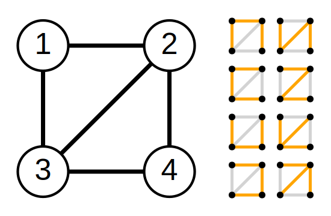

# 최소 신장 트리：Minimum Spanning Tree

## 개념정리

- <b>신장 트리(Spanning Tree)</b>란, 그래프 내의 모든 정점을 포함하는 트리를 말합니다.
- 이산수학에서 그래프이론으로 접근할 때는 그래프의 모든 간선 중에서 모든 정점들이 연결되는 최소한의 간선만 선택한 부분그래프(Subgraph)로 볼 수 있습니다. 따라서, 신장 부분 그래프(Spanning Subgraph)라고도 부릅니다.
- 필연적으로 모든 정점이 연결되어 있는 n 개의 정점을 가지는 신장 트리의 간선의 수는 n-1 개 입니다. <br/> <center>`(정점1) <-(간선1)-> (정점2) ... <-(간선 N-1)-> (정점 N)`</center>
- 필연적으로 순환(循環, Cycle)이 존재하지 않습니다. 여기서 사이클이란 임의의 정점를 시작점으로 두고 간선을 따라 일방향으로 이동할 때, 시작점으로 다시 돌아올 수 있는 경우를 의미합니다.
- 하나의 그래프에는 여러 개의 신장 트리가 존재할 수 있습니다.<br/><center><br/>다음의 그래프 조건은 8개의 신장부분그래프를 가집니다.</center>

<br/>

- <b>최소 신장 트리(Minimum Spanning Tree)</b>란, 각 간선 마다 비용, 시간, 길이 등의 가중치 값이 존재할 경우, 신장 트리 중에서 가장 가중치 합계를 가진 신장 트리를 말합니다.<br/><center><br/>다음의 그래프 조건에서 신장 트리의 최소 비용은 38 입니다.</center>

<br/>

- <b>Kruskal 알고리즘</b>과 <b>Prim 알고리즘</b>을 이용하여 구할 수 있습니다.

<br/>

## 사용예시

- 통신망, 도로망, 유통망에서 길이, 구축 비용, 전송 시간 등을 최소로 구축하려는 경우

<br/>

## 구현방법

### 1. Kruskal 알고리즘

- 간선 선택을 기반으로 하는 알고리즘
- 탐욕법(Greedy Algorithm)을 이용하여, MST는 최소 비용의 간선 집합이며 사이클이 포함되어 있지 않으므로, 반대로 모든 간선 중에 최소 비용 순서대로 연결해보고 사이클을 형성하는 지 확인하는 것으로 MST의 속하는 간선인 지를 판단합니다.
- Kruskal 알고리즘은 다음과 같은 순서로 작동합니다.

  1. 간선들을 비용에 따라 오름차순으로 정렬합니다.
  2. 간선을 순서대로 하나씩 확인하며 현재의 간선을 MST의 경로로 포함시킬 때 서로소 알고리즘(Union-find Algorithm)을 토대로 사이클을 발생시키는지 확인합니다.
  3. 사이클 발생이 없다면 해당 간선을 MST에 추가합니다.
  4. 모든 간선을 돌아보고 나면 MST를 얻을 수 있습니다.

- Kruskal 알고리즘의 시간 복잡도는 간선들을 정렬하는 시간에 영향을 받습니다. 퀵 정렬같은 효율적인 알고리즘이 사용되었다면 간선의 수 E에 대한 시간 복잡도는 O(Elog₂E) 가 됩니다.
- 그래프 내에 적은 숫자의 간선만을 가지는 희소 그래프(Sparse Graph)의 경우 Kruskal 알고리즘이 적합합니다.

#### C++

```cpp
#include <algorithm>
#include <iostream>
#include <sstream>
#include <string>

using namespace std;

// # Prototype Declaration ====================
void makeSet(int x);
int findSet(int x);
void unionSet(int x, int y);

// # Global Variable & Constant================
const string input =
  "10 21\n"
  "0 1 9\n"
  "0 2 9\n"
  "0 9 8\n"
  "0 8 18\n"
  "1 2 3\n"
  "1 4 6\n"
  "2 3 2\n"
  "2 4 4\n"
  "2 9 9\n"
  "3 4 2\n"
  "3 5 9\n"
  "3 9 8\n"
  "4 5 9\n"
  "5 6 4\n"
  "5 7 5\n"
  "5 9 7\n"
  "6 7 1\n"
  "6 8 4\n"
  "7 8 3\n"
  "7 9 9\n"
  "8 9 10\n"
  "8 10 18\n"
  "9 10 8\n";

int* nodes;
int** edges;

// # Implements Definition ====================
int main() {
  ios_base::sync_with_stdio(false);
  cin.tie(nullptr);
  cout.tie(nullptr);

  int size = 0;

  int V; // The Number of Vertices(Nodes)
  int E; // The Number of Edges

  // * INPUT
  {
    stringbuf inputbuf(input);
    streambuf *backup = cin.rdbuf(&inputbuf);

    cin >> V >> E;
    nodes = new int[V];
    edges = new int*[E];

    for (int e = 0; e < E; e++) {
      edges[e] = new int[3];
      cin >> edges[e][0] >> edges[e][1] >> edges[e][2];
    }

    cin.clear();
    cin.rdbuf(backup);
  }

  // 1. 간선들을 비용에 따라 오름차순으로 정렬합니다.
  sort(edges, edges + E,[](int* o1, int* o2) -> bool { return o1[2] < o2[2]; });

  4. 모든 간선을 돌아보고 나면 MST를 얻을 수 있습니다.


  // 자기 자신을 뿌리로 가리키도록 초기화
  for (int v = 0; v < V; v++) makeSet(v);

  // 2. 간선을 순서대로 하나씩 확인하며 현재의 간선을 MST의 경로로 포함시킬 때 서로소 알고리즘(Union-find Algorithm)을 토대로 사이클을 발생시키는지 확인합니다.
  for (int e = 0; e < E; e++) {
    int rootX = findSet(edges[e][0]);
    int rootY = findSet(edges[e][1]);

    // 3. 사이클 발생이 없다면 해당 간선을 MST에 추가합니다.
    // 뿌리가 같은 노드끼리 연결하는 간선 = 사이클을 형성하는 간선
    if (rootX == rootY) continue;

    unionSet(rootX, rootY);
    size += edges[e][2];
  }

  // * OUTPUT
  {
    // 4. 모든 간선을 돌아보고 나면 MST를 얻을 수 있습니다.
    cout << "[MST SIZE] : " << size;
  }

  delete[] nodes;
  delete[] edges;
  return 0;
}

void makeSet(int x) {
  nodes[x] = x;
}

int findSet(int x) {
  if (x == nodes[x]) return x;
  return nodes[x] = findSet(nodes[x]); // Path compression
}

void unionSet(int x, int y) {
  nodes[findSet(y)] = findSet(x);
}
```

<br/>

#### Java

```java
import java.util.Arrays;
import java.util.Comparator;
import java.util.Scanner;

public class Main {
  // # Global Variable & Constant================
  private static String input =
    "10 21\n" +
    "0 1 9\n" +
    "0 2 9\n" +
    "0 9 8\n" +
    "0 8 18\n" +
    "1 2 3\n" +
    "1 4 6\n" +
    "2 3 2\n" +
    "2 4 4\n" +
    "2 9 9\n" +
    "3 4 2\n" +
    "3 5 9\n" +
    "3 9 8\n" +
    "4 5 9\n" +
    "5 6 4\n" +
    "5 7 5\n" +
    "5 9 7\n" +
    "6 7 1\n" +
    "6 8 4\n" +
    "7 8 3\n" +
    "7 9 9\n" +
    "8 9 10\n" +
    "8 10 18\n" +
    "9 10 8\n";

  static int[] nodes;
  static int[][] edges;

  // # Implements Definition ====================
  public static void main(String[] args) {
    Main mainInstance = new Main();
    int V;
    int E;

    int size = 0;

    // * INPUT
    {
      Scanner sc = new Scanner(input);
      V = sc.nextInt(); // 정점의 갯수 0부터 시작
      E = sc.nextInt(); // 간선 갯수

      nodes = new int[V];
      edges = new int[E][3];

      for(int i = 0; i < E; i++) {
        edges[i][0] = sc.nextInt();
        edges[i][1] = sc.nextInt();
        edges[i][2] = sc.nextInt();
      }
      sc.close();
    }

    Arrays.sort(edges, new Comparator<int[]>() {
      @Override
      public int compare(int[] o1, int[] o2) {
        return o1[2] - o2[2];
      }
    });

    for(int i = 0; i < V; i++) {
      mainInstance.makeSet(i);
    }

    for(int i = 0; i < E; i++) {
      int rootX = mainInstance.findSet(edges[i][0]);
      int rootY = mainInstance.findSet(edges[i][1]);

      if(rootX != rootY) {
        mainInstance.unionSet(rootX, rootY);
        size += edges[i][2];
      }
    }

    // * OUTPUR
    {
      System.out.printf("[MST SIZE] : %d",size);
    }

    return;
  }

  void makeSet(int x) {
    nodes[x] = x;
  }

  int findSet(int x) {
    if(x == nodes[x]) return x;
    return nodes[x] = findSet(nodes[x]); // Path compression
  }

  void unionSet(int x, int y) {
    nodes[findSet(y)] = findSet(x);
  }
}
```

<br/>

### 2. Prim 알고리즘

- Prim의 알고리즘의 시간 복잡도는 O(n^2) 이므로
- 그래프에 간선이 많이 존재하는 ‘밀집 그래프(Dense Graph)’ 의 경우는 Prim 알고리즘이 적합합니다.
